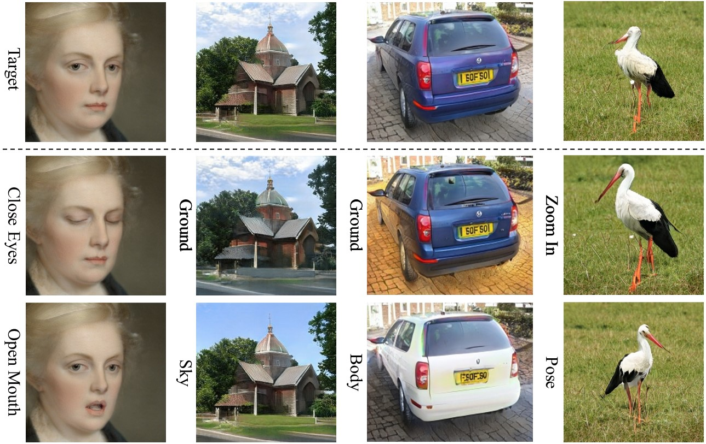
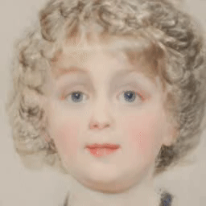
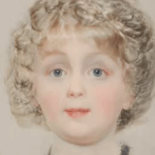
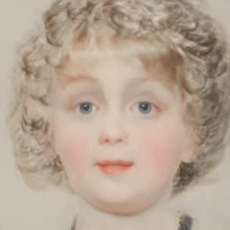
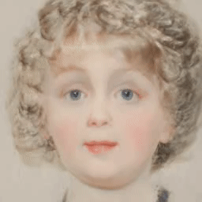

# Low-Rank Subspaces in GANs




**Figure:** *Image editing results using LowRankGAN on StyleGAN2 (first three columns) and BigGAN (last column).*

> **Low-Rank Subspaces in GANs** <br>
> Jiapeng Zhu, Ruili Feng, Yujun Shen, Deli Zhao, Zhengjun Zha, Jingren Zhou, Qifeng Chen <br>
> *Conference on Neural Information Processing Systems (NeurIPS)*

In the repository, we propose *LowRankGAN* to locally control the image synthesis from GANs with the novel *low-rank subspaces*. Concretely, we first relate the image regions with the latent space with the help of Jacobian. We then perform low-rank factorization on the Jacobian to get the principal and null spaces. We finally project the principal space *w.r.t.* the region of interest onto the null space *w.r.t.* the rest region. In this way, by altering the latent codes along the directions within the projected space, which we call low-rank subspaces, we manage to precisely control the region of interest yet barely affect the rest region.

[[Paper](https://arxiv.org/pdf/2106.04488.pdf)]
[[Project Page](https://zhujiapeng.github.io/LowRankGAN/)]
[[Demo](https://www.youtube.com/watch?v=WltRPecDq10)]

**[Stay Tuned] We are preparing the PyTorch code!**

| Examples of Local Editing |   |      |     |
|  :-- |  :--  |  :-- | :-- |
| Eyes | Mouth | Nose | Hair
|  |  |  | 

## Manipulate with Provided Directions

We have already provided some directions under the directory `directions/`. Users can easily use these directions for image local editing.

```bash
MODEL_PATH='stylegan2-ffhq-config-f-1024x1024.pkl'
DIRECTION='directions/ffhq1024/eyes_size.npy'
python manipulate.py $MODEL_PATH $DIRECTION
```

## Find More Directions

We also provide the code for users to find customized directions. Please follow the steps below.

### Step-0: Prepare the pre-trained generator

Here, we use the FFHQ model officially released in [StyleGAN2](https://github.com/NVlabs/stylegan2) as an example. Please download it first.

### Step-1: Compute Jacobian with random syntheses

```bash
MODEL_PATH='stylegan2-ffhq-config-f-1024x1024.pkl'
python compute_jacobian.py $MODEL_PATH
```

### Step-2: Compute the directions from the Jacobian

```bash
JACOBIAN_PATH='outputs/jacobian_seed_4/w_dataset_ffhq.npy'
python compute_directions.py $JACOBIAN_PATH
```

### Step-3: Verify the directions through image manipulation

```bash
MODEL_PATH='stylegan2-ffhq-config-f-1024x1024.pkl'
DIRECTION_PATH='outputs/directions/${DIRECTION_NAME}'
python manipulate.py $MODEL_PATH $DIRECTION
```

## BibTeX

```bibtex
@inproceedings{zhu2021lowrankgan,
  title     = {Low-Rank Subspaces in {GAN}s},
  author    = {Zhu, Jiapeng and Feng, Ruili and Shen, Yujun and Zhao, Deli and Zha, Zhengjun and Zhou, Jingren and Chen, Qifeng},
  booktitle = {Advances in Neural Information Processing Systems (NeurIPS)},
  year      = {2021}
}
```
